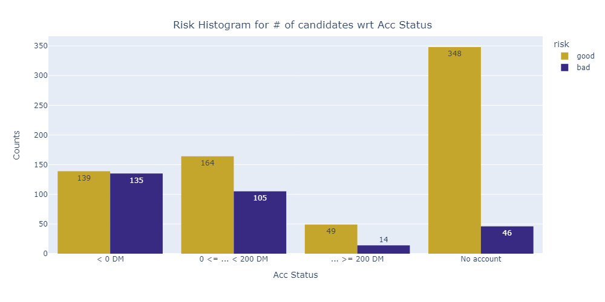

The dataset corresponds to Credit German Bank, which includes 20 features +1 as the target (client
risk), in other words, if the client is going to pay off the loan at the end. Due to the high number
of features I started aiming the problem at looking for relevant features. For that, I used Sequential
Backward Selection considering accuracy metric. The process started with all 20 features and it
ended up with 12.

    

 

The next section is an initial exploratory analysis, in which I tried to represent graphically the most
impacting features to ’risk’ (our target). In order to explore them, I ploted a correlation heatmap,
where features like ’ACC status’ and ’duration in months’ were high correlated to ’risk’. Once I
selected the final features, I started to train Random Forest model. There are other ways to find best
models, i.e., using FLML Auto ML, which is a library in python that automates the search of the
best model. But for classification problems, Random Forest and XGBoost are normally the best
ones, therefore at the end of this section, they will be compared. The next graph shows the histogram of the number of good candidates vs bad candidates with respect to 'Account status'.

    

 

The training is based on a grid search with a list of specific parameter configurations. I tried to avoid
overfitting the model, by specifying low estimator numbers (trees). The grid search is composed by
several scorers intended to be compared to the next trained model in the validation data. The cross-
validation with cv = 5 (200 samples in validation) is generated automatically. The chosen refit
metric is ’recall’. Then, once the best configuration is selected by this primary metric, is refitted
with the entire dataset. Why I selected recall metric? In my dataset, 1 denotes bad client (no pay
back) and 0 denotes good client, this nomenclature is natural to risk term. Improving recall will mean, reducing
the number of times a bad candidate (1) is classified as good candidate (0), which is more critical
than classifying a good candidate as bad.

After getting the Random Forest trained and evaluated, I trained a XGBoost applying the same
method, a grid search and same metrics for evaluation. Once I get all metrics, I compared them in
order to pick the best one as our risk classifier. Despite the fact that Random Forest is performing
better than XGBoost in training, I selected XGBoost as my classifier because it seems that it can generalize
better in evaluation data. Observing recall, XGBoost performs ~5% greater than Random Forest.
Random Forest training performs incredibly better than the other, but this is a sign of overfitting. In the following tables and graphs is the comparison carried out.

## Comparison plots and results

  
  

  
  

<h3 style="text-align: center;">TRAINING</h2>

| Model | Mode | Precision | Recall | Accuracy | AUC PR |
| :---:         |     :---:      |          :---: |     :---:      |     :---:      |     :---:      |
| Random Forest   | training     | 0.990    | 0.8567    |0.950    | 0.98    |
| XGBoost     | training       | 0.968      | 0.7830  | 0.913      |0.94  |

<h3 style="text-align: center;">VALIDATION</h2>

| Model | Mode | Precision | Recall | Accuracy | F1 | Balance Accuracy | ROC AUC |
| :---:         |     :---:      |          :---: |     :---:      |     :---:      |     :---:      |    :---:      |    :---:      |
| Random Forest   | validation     | 0.687   | 0.463    |0.7730    | 0.551    | 0.685   | 0.685   |
| XGBoost     | validation       | 0.640      | 0.510  | 0.7673      |0.560  |0.694 | 0.694|

## Annex A: XGBoost Feature Importance

    

 

